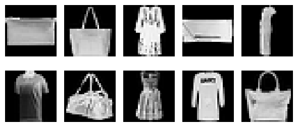
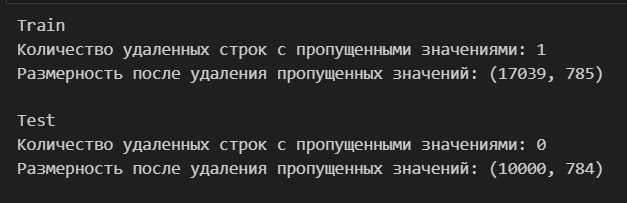
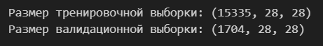
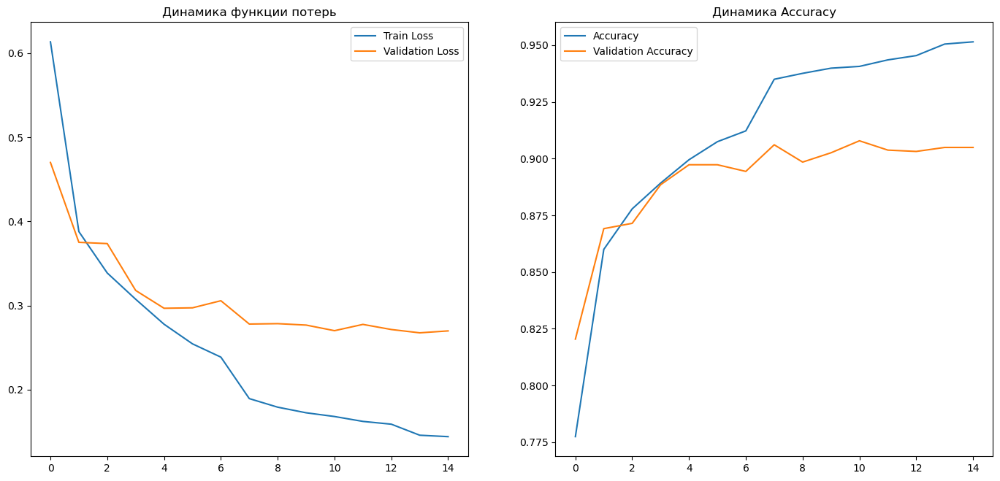

<h1 align="center">MIPT_BIO_DL</h1> 
<h2 align="center">Учебное соревнование в рамках курса “Глубокое обучение в науках о данных”.</h2> 

# Оглавление
[1. Описание задачи](#описание-задачи)

[2. Описание датасета](#описание-датасета)

[3. Решение](#решение)
    
    - Обработка
    
    - Обучение модели
    
    - Предсказание классов

## Описание задачи

Необходимо построить модель, классифицирующую изображения с одеждой, построенную на датасете Fashion-MNIST. 

Задача будет считаться решенной, если в Public Leaderboard вы наберете score, который будет равен или больше 0.85. 

В качестве метрики используется accuracy.

## Описание датасета

Fashion-MNIST – аналог знаменитого датасета MNIST, который состоит не из рукописных символов, а из предметов одежды. Он был создан, чтобы актуализировать учебные задачи в компьютерном зрении и приблизить их к реальности.

Каждое изображение представляет собой набор их 784 пикселей (28x28). Каждый пиксель принимает значение от 0 до 255, обозначая его цвет в черно-белой шкале. Обучающая выборка содержит 786 столбцов, где первый (*label*) – принадлежность изображения к классу, а последний – его уникальный номер (*Id*). Остальные столбцы – пиксели изображения.

Расшифровка классов (label), к которым принадлежат изображения:

- **0** T-shirt/top – футболка

- **1** Trouser – брюки

- **2** Pullover – свитер

- **3** Dress – платье

- **4** Coat – пальто

- **5** Sandal – сандалия

- **6** Shirt – рубашка

- **7** Sneaker – кроссовок

- **8** Bag – сумка

- **9** Ankle boot – сапог

## Решение

### Обработка данных

Данные были проверены на наличие пропусков

Разделение тренировочного датасета на тренировочный и валидационый наборы

### Обучение модели 

В процессе обучения модели были получены следующие результаты

**Выводы по графику:**
    
1) Как мы можем видить на графиках функция потерь уменьшается с каждой эпохой для тренировочного набора данных, в то время как на валидационном наборе начинает увеличиваться после 3 эпохи и снова снижаться после 6 эпохи.

2) Подтверждение первому выводу, мы можем увидеть на втором графике - Accuracy для тренировчного увеличивается с каждой эпохой, в то время как на валидационном наборе данных начинает уменьшаться после 3 эпохи, с новым пиком после 6 эпохи

3) Колебания графиков связаны с тем, что мы задавали изменения скорости обучения и шага при отсутсвии измений целевой метрики.

### Предсказание меток классов на тестовом наборе данных

В качестве ответа на платформе принимается zip-файл в котором содержится 2 столбца: **Id** и предсказанные **labels** на тестовой выборке

